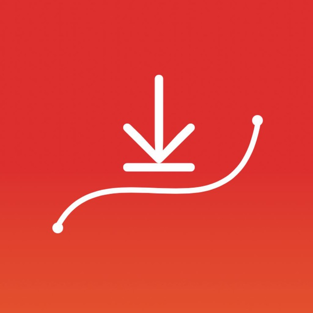
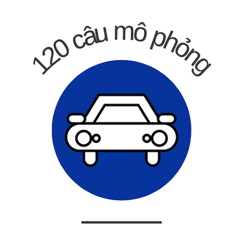

# 👋 Hi, I'm Ho Si Tuan!

I'm a passionate iOS developer with 4 years of experience building intuitive and high-performance mobile applications. I love working with iOS development by using Swift and SwiftUI, and I'm always eager to learn new technologies and improve my skills.

## 🌟 My Works

I'm currently working as a freelance developer on . I primarily focus on iOS 📱 and Android 📱 development, delivering high-quality solutions to my clients.

Feel free to explore my [Upwork profile](https://www.upwork.com/freelancers/tuanhosi) for more details on my work and client feedback.

#### Achievements
 
 

## 🛠️ My Apps

I have developed and published several apps on the App Store. Here are a couple of highlights:

- ** [Followers Reports+](https://apps.apple.com/vn/app/id6450681007):** 📊 Reached **#30** in Social Network in Italy, **#16** in Social Network in Ukraine, with **500 daily active users**.
- ** [Driver License Simulation](https://apps.apple.com/vn/app/id1629065918):** 🏆 200k downloads, reached **#1** in Education in Vietnam, boasting more than **4.4k reviews** an average rating of **4.5** ⭐⭐⭐⭐✰

You can explore all my apps on my [App Store developer profile](https://apps.apple.com/vn/developer/ho-si-tuan/id1627533415).

## 🔧 Technologies & Tools

- **Languages:**   
- **Frameworks:**   
- **Tools:**    
- **CI/CD:**  
- **Other:**         

## 🚀 What I'm Working On

I'm currently enhancing my skills in SwiftUI and exploring more advanced topics like Combine and Async/Await in Swift. I'm also delving into more robust testing strategies to ensure app quality and reliability.

## 🌱 What I'm Learning

I'm focused on expanding my knowledge in the following areas:
- 🧑‍🎨 Advanced SwiftUI techniques
- 🎥 iOS animations and transitions
- 🚀 Performance optimization in mobile apps
- 🏗️ Architectural patterns like MVVM and Clean Architecture

## 💼 Professional Experience

I've had the opportunity to work on various iOS projects, ranging from small utilities to complex, large-scale applications. My experience includes developing features, improving app performance, and collaborating with cross-functional teams to deliver high-quality software.

## 📫 Get in Touch

- 
- 
- 
-  

## 💡 Fun Fact

I'm always on the lookout for the next big thing in tech!

---

Feel free to check out my repositories and connect with me!
